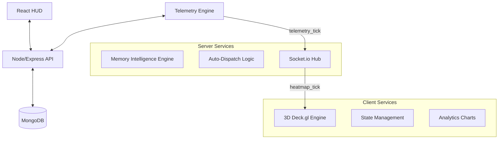

# PRAHAR 🛡️
**Dynamic Tactical Crowd Command & Geospatial Logistics Center**

**PRAHAR** is an enterprise-grade, high-fidelity command center designed for real-time monitoring, predictive crowd analytics, and tactical personnel management. It transforms complex geospatial data into an actionable 3D environment for security operations, featuring dynamic perimeter definition, manual route orchestration, and autonomous telemetry simulation.

---

## 📽️ System Visuals


*Live 3D Density Towers visualizing real-time crowd concentration.*


*Main Monitoring HUD with glassmorphism UI, real-time telemetry, and predictive alerts.*


*Comprehensive Operation Analytics and Historical Event Management.*

---

## 🌟 Core Feature Suite

### 1. Tactical Operation Builder (Full CRUD)
Precisely define operational boundaries and logistical paths.
- **Dynamic Perimeters:** Draw complex `PolygonLayer` zones with custom names and capacity thresholds.
- **Manual Route Orchestration:** Orchestrate specific ingress/egress routes using an interactive **Path Drawing Mode**.
- **On-the-Fly Geometry Editing:** Fully edit existing zones and routes (including coordinate redraws) for active or archived missions.
- **On-Site Assets:** Real-time list of all deployed assets with inline metadata editing.

### 2. Live 3D Command HUD
- **Volumetric Density Rendering:** Dynamic 3D extrusion towers that scale vertically and change color (Green -> Yellow -> Red) based on real-time occupancy percentages.
- **Route Congestion Heatmap:** Persistent paths colored dynamically based on real-time flow density simulated by the telemetry engine.
- **Personnel Telemetry:** Individual tracking of security guards with live status updates (`Patrolling`, `En Route`, `Engaged`) and automated dispatching.
- **Auto-Focus Intelligence:** Intelligent camera "Fly-To" behavior that centers on active operation sectors automatically.

### 3. Predictive Intelligence & Alerts
- **Anomaly Detection:** Real-time monitoring of zone density vs. capacity.
- **Predictive Hazard HUD:** A specialized "Threat Radar" that forecasts potential overcrowding up to 15 minutes in advance using rolling window algorithms.
- **Automated Dispatch:** System identifies the nearest available personnel to a high-density anomaly and issues direct dispatch orders.

### 4. Advanced Analytics & Operations History
- **Historical Snapshots:** Every terminated operation captures a performance snapshot (Peak Crowd, Avg Crowd, Alerts Triggered, Duration).
- **Comparative Intelligence:** Visualize historical performance across multiple missions using Bar, Pie, and Area charts (Recharts).
- **Operation Cloning:** "One-Click Restart" functionality to clone archived missions—including all geometry, routes, and personnel configs—into new active sessions.

---

## 🏗️ System Architecture



---

## 🛠️ Technology Stack

| Layer | Technology |
| :--- | :--- |
| **Frontend** | React 18, Vite, Tailwind CSS |
| **State** | Zustand (Modular Store) |
| **Mapping** | Deck.gl, MapLibre, React-Map-GL |
| **Backend** | Node.js, Express |
| **Database** | MongoDB + Mongoose |
| **Real-time** | Socket.io (Bi-directional) |
| **Telemetry** | Custom Node.js Physics Simulator |
| **Visuals** | Lucide Icons, Glassmorphism CSS |

---

## 🚀 Deployment & Installation

### 1. Prerequisites
- **Node.js**: v18.x or higher.
- **MongoDB**: Local instance or Atlas Cloud URI.
- **Environment**: Modern browser with WebGL support.

### 2. Environment Configuration
Create a `.env` in the `/server` directory:
```env
MONGO_URI=your_mongodb_connection_string
JWT_SECRET=your_secure_random_string
PORT=5000
```

### 3. Server Setup
```bash
cd server
npm install
node index.js
```

### 4. Telemetry Simulator
```bash
# Open a new terminal
cd server
node simulator.js
```

### 5. Client HUD Setup
```bash
# Open a third terminal
cd client
npm install
npm run dev
```

### 6. Seeding Data (Optional)
To populate the Analytics dashboard with historical data for demonstration:
```bash
cd server
node seedHistory.js
```

---

## 🛡️ Operational Flow
1. **Intelligence Setup**: Navigate to `Event Builder` to map your zones and drawing routes.
2. **Deployment**: Click `Launch` to initialize the live world and telemetry simulator.
3. **Active Monitoring**: Track density towers, guard positions, and predictive alerts on the `Dashboard`.
4. **Logistics Control**: Dispatch guards or focus the camera on hotspots using the `Guard Management` interface.
5. **Post-Op Analysis**: Terminate the event and view historical performance in the `Analytics` tab.
